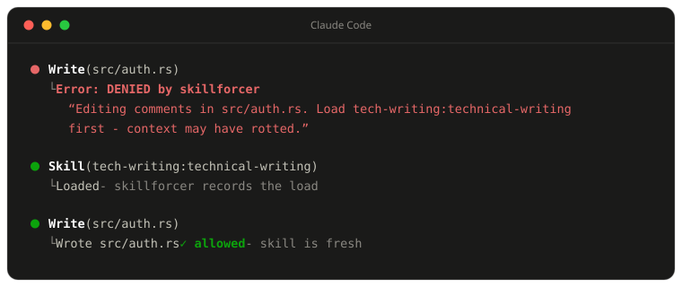
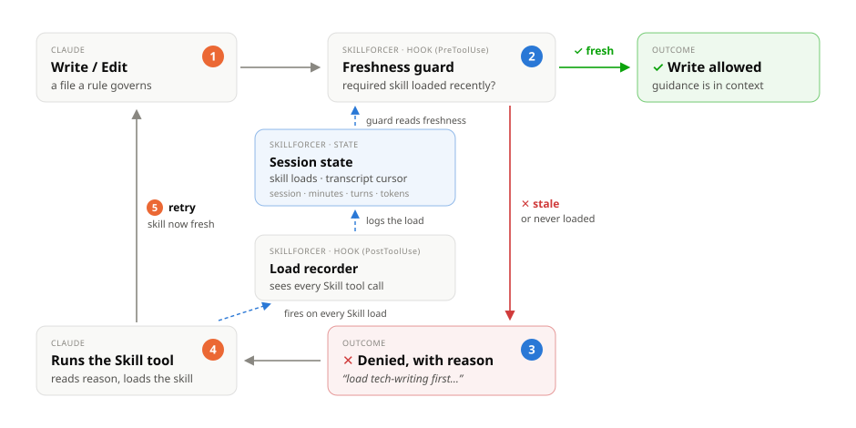

# skillforcer

**Require a skill to be loaded before the writes that depend on it — in Claude Code and OpenAI Codex CLI.**

[](https://github.com/strowk/skillforcer/actions/workflows/ci.yml)
[](https://github.com/strowk/skillforcer/releases)

Coding agents tend to not load the skills they need before writing either due to context rot or 
just because of usual LLM randomness.

In addition to that skill's guidance only applies correctly while it is recent enough.
Over a long session that body drifts out (context rot) and writes the skill governs 
(comment style, doc conventions, anything a rule can match) quietly stop following it.

skillforcer closes both gaps. It runs as a hook in your coding agent (Claude Code and
Codex CLI are supported) and denies a matching write until the required skill has loaded
recently enough, so the rule is enforced at the moment it matters instead of left to
chance.

## In action

When a rule requires the `tech-writing` skill within 15 minutes before any comment edit in
`src/**/*.rs` and Claude tries to edit a comment without it loaded:



Claude reads the denial reason, loads the skill, and retries on its own - no human in the
loop. The second write passes because the load is now fresh.

The same loop works in Codex: the write is denied with the reason, the model reads the
skill, and the retry passes.

## How it works

Two hooks, installed by the CLI. A `PreToolUse` guard decides each write (Claude's
`Write`/`Edit`/`MultiEdit`/`NotebookEdit`; Codex's `apply_patch`); a `PostToolUse`
recorder logs skill loads (Claude's `Skill` tool; Codex SKILL.md reads) to per-session
state. The session transcript - Claude's transcript or Codex's rollout - is the source
of truth, so detection holds even across the recorder. Explicit `$skill` invocations in
Codex are picked up from the rollout.

<picture>
  <source media="(prefers-color-scheme: dark)" srcset="docs/flow-dark.svg">
  
</picture>

## Install

The install scripts download a prebuilt release binary for your platform.

macOS, Linux, or Windows Git Bash:

```sh
curl -fsSL https://raw.githubusercontent.com/strowk/skillforcer/main/install.sh | sh
```

Windows PowerShell:

```powershell
irm https://raw.githubusercontent.com/strowk/skillforcer/main/install.ps1 | iex
```

The scripts install to `~/.local/bin` (POSIX) or `%LOCALAPPDATA%\skillforcer\bin`
(PowerShell). Override with `SKILLFORCER_INSTALL_DIR`, or pin a release with
`SKILLFORCER_VERSION=vX.Y.Z`.

### From source

```sh
cargo install --git https://github.com/strowk/skillforcer
# or, from a local checkout: cargo install --path .
```

### Register the hooks

From your project's root directory:

```sh
skillforcer install
```

`install` detects your coding agent from the project: `.claude/` → Claude Code,
`.codex/` or `.agents/skills/` → Codex CLI, both → both, neither → Claude Code.
Force one with `--claude` or `--codex`.

- Claude Code: hooks go to `.claude/settings.json` (`--local` for
  `settings.local.json`, `--user` for `~/.claude/settings.json`).
- Codex: hooks go to `.codex/hooks.json` (`--user` for `~/.codex/hooks.json`).
  **After installing, run `/hooks` inside Codex and approve the skillforcer hook -
  until it is trusted it enforces nothing, and `codex exec` skips untrusted hooks
  silently.**

`install` also writes a starter `.skillforcer.toml` if one doesn't exist. `uninstall`
removes the hooks it added; it never touches hooks belonging to other tools.

### Configuration skill (optional)

This repo also ships `skillforcer-config`, a Claude Code skill that walks you and Claude
through writing `.skillforcer.toml`. Install it as a plugin from this repo:

```text
/plugin marketplace add strowk/skillforcer
/plugin install skillforcer@skillforcer
```

`/plugin marketplace add` clones over your existing GitHub credentials, so it works while
the repo is private. Run `/reload-plugins` if prompted; the skill is then available to
Claude automatically and as `/skillforcer:skillforcer-config`.

To use the skill without the plugin system, copy it into a skills directory instead:

```sh
cp -r skills/skillforcer-config ~/.claude/skills/   # personal, all projects
# or .claude/skills/skillforcer-config inside one project
```

Invoked that way it is `/skillforcer-config`.

For Codex, three routes:

```text
# via Codex's plugin system (add this repo as a marketplace, then install)
/plugins            # add strowk/skillforcer as a marketplace and install skillforcer

# or via the built-in skill-installer skill
$skill-installer install the skill from strowk/skillforcer, path skills/skillforcer-config
```

Or copy it manually: `cp -r skills/skillforcer-config ~/.agents/skills/`. Codex plugin
tooling is still evolving; if the plugin route fails on your version, use either of the
other two.

## Configuration

Rules live in `.skillforcer.toml` in the project root, optionally layered over a global
config in the platform config directory - `~/.config/skillforcer/config.toml` on
Linux/macOS, `%APPDATA%\skillforcer\config\config.toml` on Windows. A project rule with
the same `name` as a global one replaces it.

```toml
[defaults]
fail_open = true          # a skillforcer error never blocks a write
combine_freshness = "all" # when multiple windows are set, all must hold

[[rule]]
name = "comments-need-tech-writing"
extends = ["code-comments"]
path = ["src/**/*.rs", "**/*.ts"]
requires = { any_skill = ["tech-writing:technical-writing"], minutes = 15 }
message = "Editing comments in {file}. Load {skills} first - context may have rotted."
```

Each rule matches a write by `path` (glob patterns) and, optionally, `content` (a regex
tested against the new text). `extends` adds a preset's `path` patterns to the rule's
own and fills in `content` from the preset when the rule doesn't set one. `requires`
names the skill(s) (`any_skill` or `all_skills`, exactly one of the two) and the
freshness window(s) that must hold. `message` supports `{file}`, `{rule}`, `{skills}`,
and `{reason}` placeholders; omit it to use the built-in default message.

Skill names match by suffix across agents: `tech-writing:technical-writing` also matches
a Codex load of the `technical-writing` skill directory.

### Freshness modes

A rule can combine any of these; `combine_freshness` (`all` or `any`) decides whether
they all need to hold or just one:

| Mode | Config key | Satisfied when |
| --- | --- | --- |
| Session | `session = true` | the skill has loaded at least once this session |
| Minutes | `minutes = N` | the skill loaded within the last N minutes |
| Turns | `turns = N` | the skill loaded within the last N transcript turns |
| Tokens | `tokens = N` | the skill loaded within the last N output tokens |

With `combine_freshness = "all"` (the default), every window on the rule must pass; with
`"any"`, one passing window is enough.

### Presets

`skillforcer list-presets` prints the bundled presets and the glob paths each covers:

- `code-comments` - comment syntax across common languages (`//`, `/* */`, `<!--`, `#`, `;;`)
- `markdown-headings` - Markdown ATX headings (`#` through `######`)

Reference one from `extends` instead of copying its `path`/`content` into every rule.

## Debugging

- `skillforcer check <file> [--stdin]` - reports which rules match a file (and its
  content, from the file or stdin), without needing a session or transcript.
- `skillforcer status [--session ID]` - prints the recorded skill loads and transcript
  cursor (offset/turn/tokens) for a session, from the on-disk state store.

## Fail-open

skillforcer never blocks a write because of its own error: malformed hook JSON, a
missing or unreadable config, and an unreadable transcript line all resolve to `Allow`.
With `fail_open = true` (the default), a rule that fails to compile is skipped (other
rules still apply); set `fail_open = false` to make a bad rule deny instead. The binary
itself also exits `0` on any top-level error.
